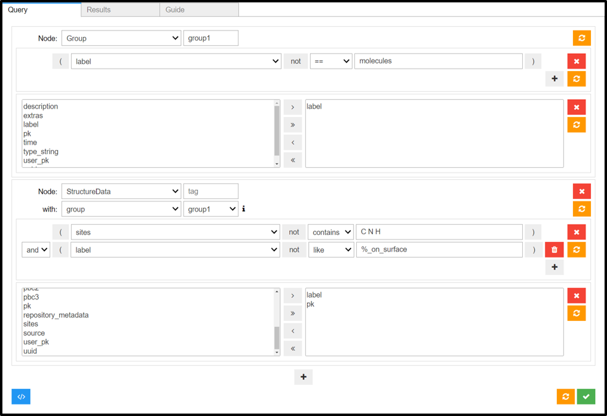

# Design recommendations for user interfaces to interact with digital twins

### Abstract

This document outlines guidelines and best practices for designing user interfaces (UI) that facilitate the interoperability of open research data from experiments and simulations, focusing on the FAIR treatment of physical samples in the digital domain. It emphasizes the importance of semantically annotated metadata to ensure reproducibility and interoperability, alongside meticulous tracking of sample histories. Developed under the PREMISE project, these guidelines leverage insights from the Aurora autonomous battery assembly and testing platform within the AiiDAlab environment and ongoing modifications for interoperability with the openBIS ELN. Key recommendations include using an ELN as a single source of truth, structuring digital twins with comprehensive metadata, recording process outcomes, and ensuring a closed-loop system for sample and protocol management. The document also provides UI design principles for managing inventory, constructing experiments, analyzing results, and exploring previous submissions, all aimed at maintaining data integrity and enhancing user experience. The guidelines are dynamic and will evolve with the PREMISE project to reflect practical applications and new insights.

---

Facilitating interoperability of open research data from experiments and simulation requires a FAIR treatment of physical samples in the digital domain. Samples and experimental protocols that one may perform on them should be defined with sufficient, semantically annotated metadata to ensure reproducibility and interoperability. Furthermore, the history of a sample throughout its lifetime must be carefully tracked to ensure consistency between experimental and computational processes. The present document provides guidelines and best-practices for designing user interfaces to interact with the digital representations of physical samples and protocols in experimental and computational platforms. These guidelines are developed under the PREMISE project in establishing the infrastructure for experimental and simulation platform interoperability.

Throughout the document, a dedicated UI for the [Aurora autonomous battery assembly and testing platform](https://pubs.rsc.org/en/content/articlelanding/2024/ta/d3ta06889g) designed in the [AiiDAlab](https://www.aiidalab.net/) GUI companion of the [AiiDA](https://www.aiida.net/) WFMS as part of the [BIG-MAP Stakeholder Initiative](https://www.big-map.eu/) will be used to demonstrate the relevant recommendations and guidelines discussed in the document. The [Aurora-AiiDAlab](https://big-map.github.io/big-map-registry/apps/aiidalab-aurora.html) app has been used at the [Materials for Energy Conversion Laboratory](https://www.empa.ch/web/s501) at Empa to build, submit, and analyze results from coin-cell cycling experiments. The app is documented [online](https://aiidalab-aurora.readthedocs.io/en/latest/). Ongoing efforts are underway to modify the app’s interface towards interoperability with the [openBIS](https://openbis.ch/) ELN in a platform-independent manner following the guidelines of PREMISE’s deliverable [D1.1](https://github.com/ord-premise/interoperability-guidelines). These developments will further drive UI design guidelines and as such, will impact and accordingly update this document.

Where appropriate, a second example pertaining to [microscopy and spectroscopy experiments of molecules on surfaces](https://www.empa.ch/web/s205/atomistic-simulations) carried out at Empa may also be used as an example to highlight the challenges revolving the use of digital twins. Similarly, added insight from this use case will impact the guidelines discussed herein. Note that when discussing digital twins, the definition provided by [NASA](https://www.emacromall.com/reference/NASA-Modeling-Simulation-IT-Processing-Roadmap.pdf) is considered, with its three requirements:

###### i. The physical object is represented sufficiently and semantically in the digital domain

###### ii. Process outcomes are integrated into the digital twin (e.g. via experiment/process/dataset hierarchy)

###### iii. The digital twin evolves in a closed loop by its processes

With the above in mind, the following recommendations are based on the experience and insight gained in the first year of the PREMISE project. Note that the document is a living one, and as such, will be updated throughout the life of the project as its guidelines and recommendations are put to the test.

## Single source of truth

Ensuring reproducibility requires data integrity and trust. Due to the possibility of so-called out-of-band processes (fig. 1) not tracked by a WFMS, run either manually or autonomously, it is recommended that an ELN be taken as the single source of truth. As such, any modifications made to samples and protocols must be recorded accordingly in the ELN, regardless of the source of mutation.

**Figure 1** - _An illustration of the flow of data in and out an electronic lab notebook (ELN) and workflow management system (WFMS) platforms. Due to the potential of so-called out-of-band (WFMS-bypassing) processes directly accessing ELN data, it is recommended that the ELN be considered the single source of truth with respect to an integrated interoperable system._

## Recording digital twins in an ELN

The design and layouts of ELNs are likely to vary in implementation. However, at least in the field of materials science, some recommendations can be made regarding the layout of an ELN instance. Though comments are made here with respect to the implementation of openBIS, the recommendations are meant more generally.

Digital twins of experimental samples and protocols are typically stored in an inventory section. When recording an experiment and its processes in an ELN, the inventory is leveraged to associate samples and experiments. However, the specifics of the layout in which ELN nodes are attached with respect to an experiment is often left arbitrary. Experimental processes may mutate the sample, changing its properties, or state. These must be handled appropriately We recommended the following criteria be considered (fig. 2):

- If a process is non-destructive, non-mutating, it may be attached directly to the sample
- If a process is non-destructive, but mutating, the mutation is applied directly to the sample to be tracked internally in the sample's history (if implemented). Subsequent processes are attached as children of this process to reflect the state change
- If a process is destructive in the sense that it transforms a sample beyond what is recordable, a new sample should be created. This is also true in the previous case if no history tracking is implemented internally

The concept of digital twin mutation is further addressed in the following section.

**Figure 2** - _An illustration of ELN heirarchies. On the left, a case where processes taken on a sample are non-destructive and are attached as direct children of the sample. In the center, the first process mutates the sample. Hence, the second process is attached as a child of the first. On the right, a destructive process irreparably changes the sample, effectively resulting in a new sample. Following processes are attached to the new sample._

## Digital twin construction and mutation

In working with digital twins, a first step is often constructing the digital representation of the physical models and processes involved in an experiment. When such digital representations are used in automated workflows involving both experimental and simulation platforms, it is crucial that the user interface provides room for sufficient input, both machine and user generated, to ensure reproducibility at both ends. We describe in this section a few recommendations to keep in mind when handling digital twins. Relevant UI component examples from the Aurora project are provided in a [later section](#designing-the-graphical-user-interface-of-the-workflow-manager).

In the case of Aurora, where coin cell assembly is robot driven, the UI becomes an integrated component of the assembly process. As such, a UI component should be designed to select from available coin cell components in preparation for assembly. If developed in the WFMS UI (e.g. AiiDAlab), samples are to be recorded back in the ELN upon assembly submission per the principle of [single source of truth](#single-source-of-truth). Note that due to technical limitations of the present instrumentation, AiiDAlab has yet to be connected with the assembly robot for this purpose. Future developments towards this feature will be mentioned here.

Other than the physical samples required for an experiment, one or more protocols must be defined to perform on the samples as an experiment. A UI for constructing protocols could be design at both ends, with a caveat. Once a protocol is associated with at least one experiment, it must be frozen to ensure reproducibility. This is recommended at least for ELNs. Consider an ELN UI allowing for protocol mutation while keeping previously recorded experiments consistent by linking to historical states of a protocol. This can quickly lead to confusion, as repeated mutations may render a protocol entirely unique with respect to its initial state (fig. 3a). Further associating the protocol with experiments could be misleading. As such, it is recommended to avoid mutations entirely in the ELN and instead opt for unique protocols per property set.

However, a WFMS UI for protocol construction can and should still support protocol mutability but must also ensure that the digital twin of the protocol is decoupled from its tracked provenance. To illustrate, suppose experiment 1 used protocol 1-A, that is, protocol 1 in state A, or P 1-A. A mutation, or edit, of P 1-A resulting in P 1-B may be performed **if and only if** experiment 1 is linked to P 1-A in the stored provenance. Subsequent experiments submitted with protocol 1 would then be linked to P 1-B (fig. 3b). The provenance is thus preserved.

**Figure 3** - _An illustration of the consequences of protocol mutations. a) protocol mutations recorded by an ELN in the history of a protocol. Note that repeated mutations may result in a state no longer overlapping any properties of the initial state. Hence, protocol mutations in the ELN (the single source of truth) are discouraged. b) protocol mutations made in a WFMS UI. Here, as long as the WFMS adopts object immutability, protocol mutation may be supported **if and only if** previous states are decoupled (perserve their state) in the provenance._

## Recording process outcomes (sample/process history)

For a digital twin of a sample, following the requirement of [evolution by processes](#iii-the-digital-twin-evolves-in-a-closed-loop-by-its-processes), a non-destructive process should not create a new sample, but rather provide an outcome (dataset) containing: (i) the raw data results of the process, and (ii) the new state to which the process had evolved the sample. These are in turn integrated into the sample entry in the ELN, both as a parent-child hierarchy of processes (fig. 4a), and as sample mutations to be recorded in the sample's history (fig. 4b). If the experiment managed by the WFMS includes a series of processes, the WFMS is required to track sample state changes internally and report to the ELN the full experiment provenance (fig. 4c). This forms a closed system with respect to sample mutation, in the sense that requested samples (and protocols) at the WFMS UI side are responded with the latest state by the ELN (fig. 4d), ensuring consistency. However, as a further measure, it is crucial that on, or rather directly prior to submitting an experiment, the WFMS UI validates its components (samples and protocols) against the ELN as a final consistency check.

To further illustrate the above, consider a typical use case of Aurora, where an experiment is performed on a sample consisting of one sample/electrolyte interface formation protocol, and one long-term cycling protocol (fig. #). The user would construct said experiment from a sample and protocols acquired from an ELN (e.g. openBIS) in a [platform-agnostic](https://www.youtube.com/watch?v=4ml6H6Np0Wo) manner. The sample will contain the last known state, as will each protocol. Immediately prior to submission, a check is performed to validate state consistency to ensure the sample is in the expected state. The state will reflect the most recent mutation, regardless if it was caused by a WFMS-tracked process. The user should be warned if the state does not match the expectation of the WFMS. Otherwise, the WFMS proceeds to submit the experiment. During the experiment, each protocol results in a state change, which is recorded and transferred to the next protocol. Upon completion, the experiment provenance is exported to the ELN, which in turn unpacks and maps the experiment as a child of the sample (fig. 4e). Each protocol is attached to the experiment (in order), and its associated dataset is attached as a child of the protocol. Finally, each resultant state change is recorded as a mutation to the associated sample.

**Figure 4** - _An illustration of process outcome recording and sample evolution. Objects are given as follows: Sample (green plant); Experiment (yellow workflow); Process (blue vial); Dataset (orange disk). Numbers in pink diamonds represet the object's state. a) parent-child relationships in the ELN; b) sample mutation record keeping; c) WFMS internal record keeping of state change (pink diamonds) during workflow execution; d) latest (!) states received from the ELN; e) complete workflow, including all steps, datasets, and mutations, sent back to the ELN._

## Designing the graphical user interface of the workflow manager

The above sections focus on the integration of experimental results into a digital twin and its evolution by these results, as stated in the [NASA requirements for digital twins](https://www.emacromall.com/reference/NASA-Modeling-Simulation-IT-Processing-Roadmap.pdf). This section and its subsections will focus on the design of a graphical user interface for building experiments and exploring and analyzing their results.

#### 1. The inventory

Experiments in materials science require at the least one sample and one process to apply to the sample. An experiment workflow may consist of several of these processes. As such, it is recommended to provide a section in the UI to manage samples and processes. The section should be carefully integrated and coordinated against the associated ELN to ensure data consistency.

It is recommended to include the following for samples (fig. 5a):

- A detailed viewer – at least text-based for differentiation, though graphical viewers/editors, if feasible, could provide sample design and construction functionality
- An importer to upload existing samples from raw files of arbitrary format
- Sorting/filtering functionality for improved user experience
- Sample grouping to enhance sorting/filtering capabilities
- User-input widgets to modify samples (see above section on [digital twin mutations](#digital-twin-construction-and-mutation))

For experimental protocols, the following is recommended (fig. 5b):

- A detailed viewer
- Sorting/filtering functionality for improved user experience
- A protocol editor

For both, it is crucial to ensure consistency against the associated ELN. As such, any modifications must be synchronized with the ELN in a way that protects the integrity of the provenances of both the ELN and the WFMS. See above sections on [digital twin mutations](#digital-twin-construction-and-mutation) for more detail.

**Figure 5** - _WFMS UI for managing experimental inventory components. a) UI for importing, filtering, viewing, and grouping samples; b) UI for creating and editing experimental protocols._

#### 2. The constructor

With samples and protocols made available in the inventory, the user may proceed to construct experiments. For this purpose, it is recommended to design a wizard-like experiment builder to walk the user through the steps of constructing the experiment (fig. 6). These include: (i) sample and protocol selection steps, where sorting/filtering functionality is highly advised to enhance user experience; (ii) a configuration section for system-dependent setup (e.g. instrument settings, live monitoring, etc.); (iii) an input preview section for the user to verify their selection, where it is recommended to implement automatic validations; and (iv) submission controls.

**Figure 6** - _WFMS UI for preparing and submitting experiments. a) sample selection; b) protocol selection; c) instrument settings selection; d) input preview; e) experiment submission controls._

#### 3. The analyzer

Users often wish to inspect and analyze the results of completed experiments. Though such features maybe available on the ELN side, it is recommended to integrate analysis tools into the same interface used for submission to improve user experience. In the Aurora AiiDAlab app, such a tool was implemented allowing users to quickly filter through previously submitted experiments (including custom experiment groups). Here, the user can view both completed and running experiments.

For completed experiments, the user can visualize post-processed data, both by series (fig. 7a), and statistically aggregated results (fig. 7b). Multiple plots may be shown at any given time, each providing on top of the visual representation a summary a text-based summary of the experimental results, and a set of plot controls to modify or download the plot. For running experiments where live monitoring was assigned during experiment construction, the user may view partial data and choose to terminate an experiment if deemed faulty.

**Figure 7** - _WFMS UI for analyzing experimental results. a) multi-series plotting; b) statistical aggregate plotting._

#### 4. The explorer

Lastly, a user may wish to search for one or more previously submitted experiments. It is then recommended to include in the user interface an explorer section following the common design of web-based advanced search tools (fig. 8). These tools are often storage-system-dependent. For example, an explorer tool is currently being designed to work against AiiDA’s QueryBuilder tool. However, the UI of said tool regardless should follow a modern-day advanced search pattern to facilitate user experience.

**Figure 8** - _WFMS UI for querying data._

## Conclusions

Designing user interfaces for digital twins involves careful integration and synchronization of both the ELN and the WFMS user interfaces to facilitate data integration into and mutation of digital twins while ensuring the integrity of the overall provenance. The present document provides guidelines for such ventures from the gained insights and experience of the PREMISE project and will be modified periodically as the project continues to apply its findings in practice.
